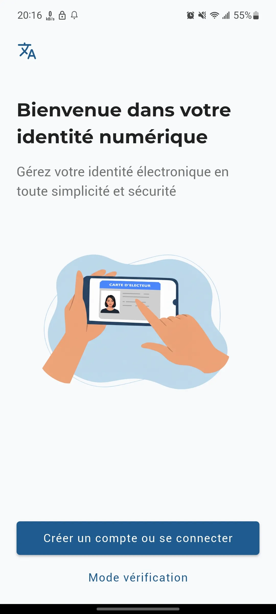
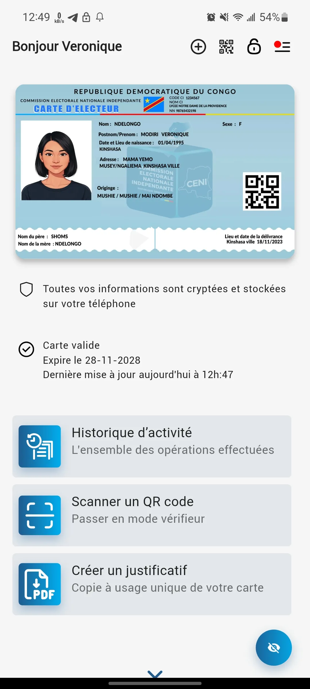

# 📱 Mokanda

🚀 **[Accéder à l'application / Télécharger Mokanda](https://mokanda.netlify.app)**

**Mokanda** est une solution numérique innovante conçue pour lutter contre la détérioration et la perte des documents officiels physiques. L'application permet de centraliser et de sécuriser ses pièces d'identité directement dans son smartphone.

---

## 💡 Le Problème & La Solution

*   **⚠️ Le Constat :** Actuellement, les cartes d'électeurs (faisant office de pièce d'identité) s'effacent rapidement avec le temps et deviennent totalement illisibles. Plusieurs citoyens congolais ont dénoncé ce calvaire.
*   **✅ La Solution Mokanda :** Une alternative 100% numérique. Mokanda règle définitivement le problème de l'usure physique : votre identité est sécurisée, inaltérable et toujours lisible sur votre smartphone, avec une vérification fiable (OTP, biométrie).

---

## 📸 Aperçu du Prototype

Voici un aperçu visuel de l'interface, pour plus d'images regarder dans les dossiers **screenshots** :

| Écran d'accueil | Détails du Document | Paramètres |
| :---: | :---: | :---: |
|  |  |  |

---

## 🛠️ Technologies & Compétences

Ce prototype met en avant des compétences solides en développement d'applications mobiles et en design d'expérience utilisateur (UX/UI) :

*   **Framework :** Flutter & Dart (pour une fluidité maximale et des animations de transition soignées).
*   **Design :** Interface moderne, épurée et pensée pour être accessible à tout type d'utilisateur.
*   **Architecture :** Structuration propre du code permettant une intégration future de modules de scan avancé (OCR) et de bases de données sécurisées.

---

## 🚀 Objectif du Projet

Mokanda démontre ma capacité à concevoir une application mobile de bout en bout qui répond à un problème concret du quotidien, en alliant design d'interface moderne et logique de développement robuste.