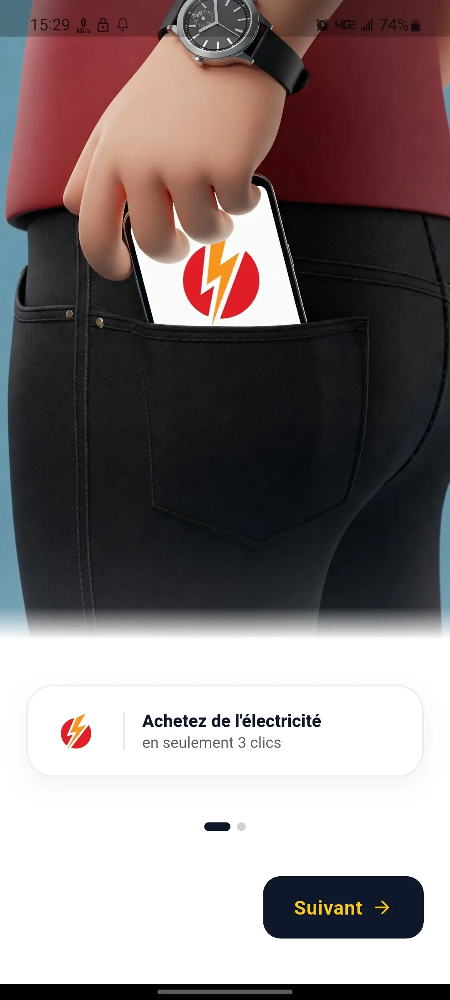
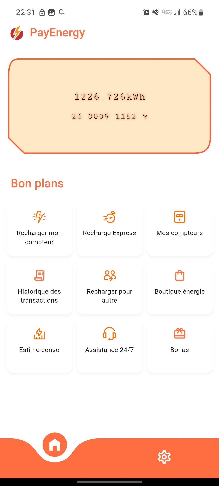
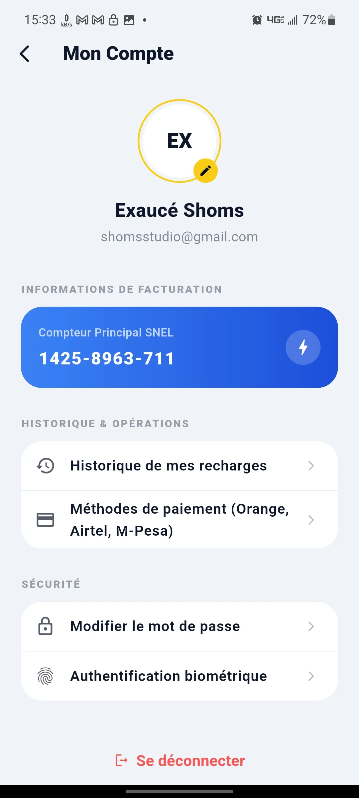
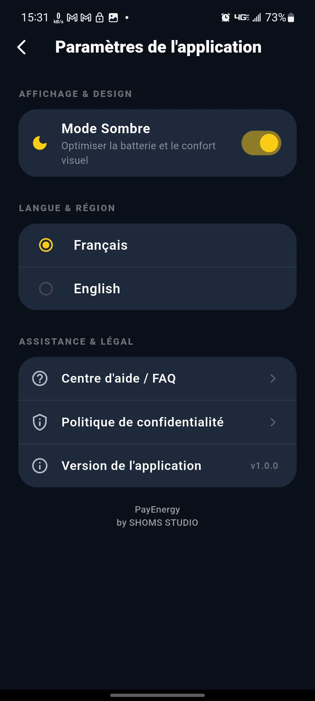

# 📱 PayEnergy `(En développement... ⏳)`

**PayEnergy** est une solution innovante conçue pour éviter les déplacements inutiles et simplifier le quotidien. L'application permet de recharger son compteur électrique prépayé SNEL directement depuis chez soi grâce aux paiements mobiles.

---

## 💡 Le Problème & La Solution

*   **⚠️ Le Constat :** Pour espérer acheter du crédit dans un bureau de la SNEL, il faut prévoir en moyenne une demi-journée, voire une journée entière, en raison de la forte demande et des files d'attente, pour une opération qui ne dure pourtant que 2 minutes.
*   **✅ La Solution PayEnergy :** Plus besoin de se déplacer. Avec PayEnergy, rechargez votre propre compteur ou celui d'un proche en seulement 3 clics. Une alternative simple, rapide et sécurisée.

---

## 📸 Aperçu du Prototype

Voici un aperçu visuel de l'interface et du tunnel d'achat de crédit :

| Écran de démarrage | Écran d'accueil | Profil utilisateur | Paramètres de l'application |
| :---: | :---: | :---: | :---: |
|  |  |  |  |

---

## 🛠️ Technologies & Compétences

En plus de mettre en avant des compétences solides en développement mobile, ce prototype démontre une forte capacité d'intégration d'APIs avancées, le tout enveloppé dans un design simple, moderne et accessible à tous :

*   **Framework & Langage :** Flutter & Dart (pour une expérience utilisateur fluide et cross-platform).
*   **Intégrations & APIs :** 
    *   Google APIs (pour les services de localisation ou de cartographie).
    *   Mobile Money APIs (intégration des opérateurs majeurs : Orange Money, M-Pesa/Vodacom, Airtel Money et Africell).
*   **Architecture :** Structuration propre et modulaire du code permettant une intégration future de nouveaux modules et de nouveaux moyens de paiement.

---

## 🚀 Objectif du Projet

PayEnergy démontre ma capacité à concevoir une application mobile de bout en bout qui répond à un problème concret du quotidien, en alliant design d'interface moderne, logique de développement robuste et interconnexion avec des services tiers (APIs de paiement).