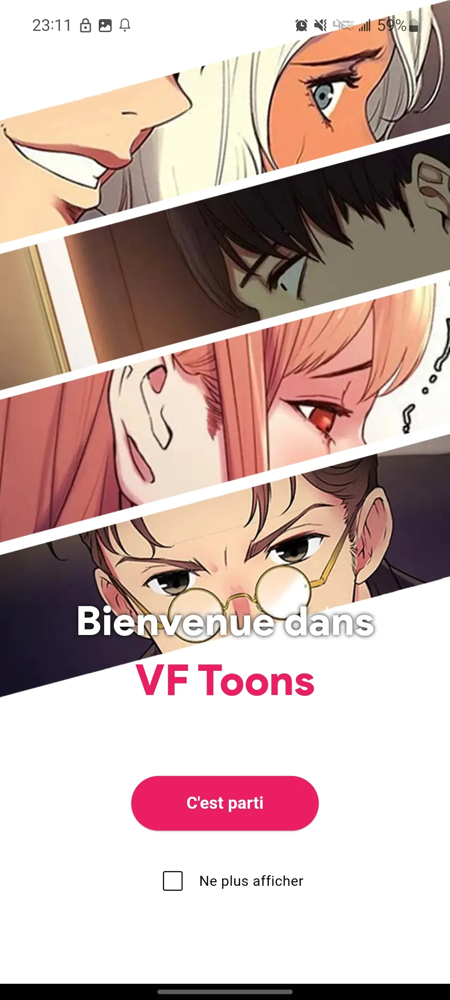
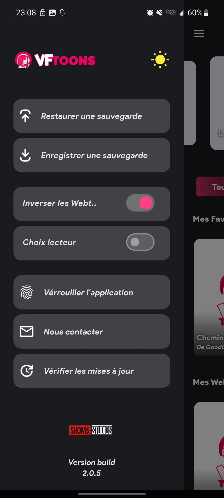

# 📱 VF Toons `(Publié & Actif ✅)`

🚀 **[Accéder à l'application / Télécharger VF Toons](https://vftoons.netlify.app)**

**VF Toons** est une application mobile de lecture optimisée, spécialement conçue pour les passionnés de Webtoons et de Mangas. Elle offre une expérience immersive et hautement personnalisable pour les lecteurs les plus exigeants.

---

## 💡 Le Problème & La Solution

*   **⚠️ Le Constat :** Bien qu'il existe de nombreuses applications de lecture sur le marché, la majorité souffre de fonctionnalités identiques, de lenteurs de chargement ou d'un manque de confort visuel qui ne répondent pas aux besoins des lecteurs intensifs.
*   **✅ La Solution VF Toons :** Une application propulsée par un mécanisme d'affichage puissant et plusieurs moteurs de rendu sur-mesure conçus de bout en bout. VF Toons corrige les défauts des lecteurs traditionnels pour garantir une lecture fluide, confortable et une gestion optimale du cache des images.

---

## 📸 Aperçu de l'Application

Voici un aperçu de l'interface utilisateur et de l'expérience de lecture :

| Écran de démarrage | menu |
| :---: | :---: |
|  |  |

---

## 🛠️ Technologies & Compétences

Ce projet met en avant des compétences avancées en optimisation de performances mobiles et en manipulation de contenus web hybrides :

*   **Framework & Langages :** Flutter & Dart (pour l'application native) interconnectés avec JavaScript, HTML5 et CSS3 pour la gestion et le formatage dynamique des moteurs de lecture.
*   **Performance :** Conception d'un système de rendu d'images performant, crucial pour le chargement fluide de fichiers graphiques volumineux sans impacter la mémoire du smartphone.
*   **Architecture :** Structure de code propre et modulaire, facilitant l'ajout régulier de nouvelles fonctionnalités et le support de nouveaux formats de lecture.

---

## 🚀 Objectif du Projet

VF Toons est la preuve de ma capacité à mener un projet de bout en bout, de la conception à la publication, tout en résolvant des problématiques techniques complexes liées à l'affichage de données en haute performance et à la gestion d'une communauté d'utilisateurs active.